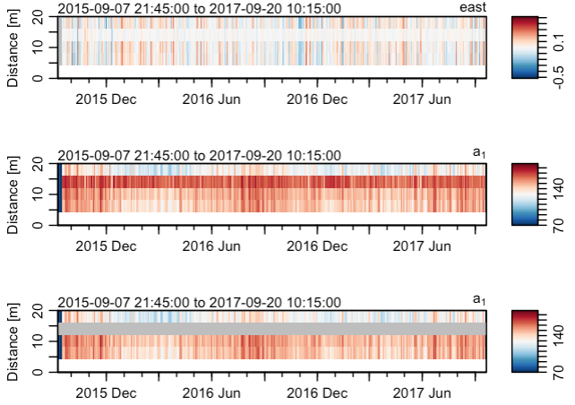
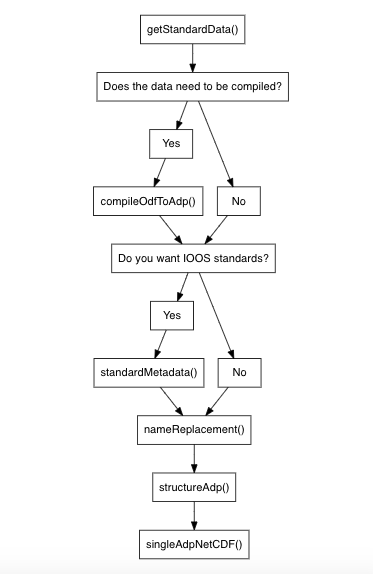

# Introduction

This vignette discusses the steps to process and convert a moored acoustic doppler current profiler (ADCP) file to a NetCDF file. Currently (2023/03/01) the `odfToNetCDF` package has the ability to convert ADCP files with an ODF origin (both those that need to be compiled into one `adp` object and those that do not) and files with a raw RDI origin to NetCDFs following CF standards. This document will demonstrate the conversion of an ADCP object of raw RDI origin from the Davis Strait.

To being, the file is read as an `oce` object.

```{r, eval=FALSE}
library(oce)
library(odfToNetCDF)
ADP <- read.oce("adcpRDI.000")
```

Now that the `adp` object had the desired `data` and `metadata`, processing began. The first step in processing is to account for the declination using the new `applyMagneticDeclination` function in `oce`. It should be noted that in order to use this function, the user is required to use the `develop` branch of `oce`. 


```{r, eval=FALSE}
# Processing the data
# Correct declination
declination <- magneticField(longitude=ADP[['longitude']], latitude=ADP[['latitude']],time = ADP[['time']])$declination
ADP2 <- applyMagneticDeclination(ADP, declination=declination)
```

Secondly, the `adpConvertRawToNumeric` function is used to convert variables with the same dimensions as `v` (velocity in m/s) that are raw to be numeric. 

```{r, eval=FALSE}
# Change raw variables into numeric
ADP3 <- adpConvertRawToNumeric(ADP2)
```

Next, if flags did not already exist in the `adp` object, they are initialized using the `initializeFlags` function in `oce`. We do this to then be able to use the `adpFlagPastBoundary` function. This function flags variables with the same dimension as `v` that are beyond the water column. This data is then set to NA using `handleFlags`. It's important to note that as of today (2023/02/28), the `adpFlagPastBoundary` only works on `adp` objects that contain `br` (bottom range). See Figure 1 for an example of file "wh0493_C1_105m/ds15_000.000" having `adpFlagPastBoundary` applied to it.

```{r, eval=FALSE}
ADP3 <- initializeFlags(ADP3,name="v", value=1)
ADP3 <- initializeFlags(ADP3,name="a", value=1)
ADP3 <- initializeFlags(ADP3,name="g", value=1)
ADP3 <- initializeFlags(ADP3,name="q", value=1)

adps3 <- adpFlagPastBoundary(ADP3)

# Example of wh0493_C1_105m/ds15_000.000
par(mfrow=c(2,1))
plot(adps3, which="a1")
plot(handleFlags(adps3, flags=4), which="a1")
```


```{r echo=FALSE, fig.cap = "Top - Time series of amplitude from beam 1. Bottom - As top, except after adpFlagPastBoundary and handleFlags have been applied."}
knitr::include_graphics("clean.png")
```

\pagebreak

After data beyond the water boundary are flagged, profiles are manually flagged if there was a spike in amplitude followed with a sudden change in velocity (See Figure 2). This was likely a result of another instrument on the moored line, and the associated bin was therefore flagged using the `flagSpecific` function and set to NA using `handleFlags`. 

```{r, eval=FALSE}
flagSpecific <- function(x=NULL, fields=NULL, debug=0, top=NULL, bottom=NULL)
{
  if (!inherits(x, "adp")) {
    stop("x must be an adp object")
  }
  if (is.null(top)) {
    stop("must provide a top argument")
  }
  if (is.null(bottom)) {
    stop("must provide a bottom argument")
  }
  dimNeeded <- dim(x[["v"]])
  if (is.null(fields)) {
    dataNames <- names(x@data)
    keep <- sapply(dataNames,
                   function(variableTrial) {
                     dimtest <- dim(x[[variableTrial]])
                     length(dimtest) == 3 && all(dimtest == dimNeeded)
                   })
    fields <- dataNames[keep]
    if (debug > 0) {
      message("inferred fields =", paste0(fields, collapse=","))
    }
  }
  
  
  numberOfBeams <- dim(x[['v']])[3]
  if (debug > 0) {
    message("The number of beams =", numberOfBeams)
  }
  for (b in 1:numberOfBeams) {
    bad <- which(x[['distance']] < top & bottom < x[['distance']]) #3
    for (i in seq_along(fields)) {
      #adps3[[1]][['flags']]$v[,,1][,which(adps3[[1]][['distance']] < 16.1 & 12.1 < adps3[[1]][['distance']])]
      x[['flags']][[fields[[i]]]][,,b][,bad] <- 4
    }
  }
  return(x)
}

adps3 <- flagSpecific(adps3, top=16.1, bottom=12.1)

# Set any data that was flagged bad during processing to NA
ADP4 <- handleFlags(adps3, flags=4)

# Example of wh0493_C1_105m/ds15_000.000
par(mfrow=c(3,1))
plot(adps3, which=1, ylim=c(0,20))
plot(adps3, which="a1", ylim=c(0,20))
plot(ADP4, which="a1", ylim=c(0,20))
```

```{r echo=FALSE, fig.cap = "Top - Eastward velocity in distance 1 to 20 m of the water column Middle - As for top, except with amplitude in beam 1. Bottom - As for middle except after flagSpecific and handleFlags have been applied."}

```

\pagebreak

As shown in Figure 2, from ~ 12 m to 16 m there is a spike in amplitude accompanied by a sudden change in eastward velocity. This indicated that `flagSpecific` should be applied, and the result can be shown in Figure 2 (bottom).

Another function, `adpFlagCorrelation` was also created with the intent to flag any data with that had a `q` (correlation magnitude) with a 70% correlation or less. For the sake of the Davis Strait data, this data did not have correlation magnitude of 70% or more, and we therefore did not apply this function to the data.  


```{r, eval=FALSE}
adpFlagCorrelation <- function(x=NULL, fields=NULL, debug=0, correlation=70)
{
  oceDebug(debug, "adpFlagCorrelation() {\n", sep="", unindent=1, style="bold")
  if (!inherits(x, "adp")) {
    stop("x must be an adp object")
  }
  numberOfBeams <- dim(x[['v']])[3]
  if (debug > 0) {
    message("The number of beams =", numberOfBeams)
  }
  fields <-  "v" # # This only changes the velocity
  for (b in 1:numberOfBeams) {
    bad <- correlation
    for (i in seq_along(fields)) {
      badAmp <- (x[['q']][,,b]/255)*100 < bad
      browser()
      if (any(badAmp == TRUE)) {
      badAmp[which(badAmp == TRUE)] <- 4
      }
      if (any(badAmp == FALSE)) {
      badAmp[which(badAmp == FALSE)] <- 1
      }
      if (any(x[['flags']][[fields[[i]]]][,,b] == 4)) {
        # This merges flags that have already been added
        flaggedBad <- which(x[['flags']][[fields[[i]]]][,,b] == 4)
        badAmp[flaggedBad] <- 4
        x[["flags"]][[fields[i]]][,,b] <- badAmp
      } else {
        x[["flags"]][[fields[i]]][,,b] <- badAmp
      }
    }
  }
  return(x)
}
#ADP5 <- adpFlagCorrelation(ADP4, correlation=70)
```

It it then time to use the `odfToNetCDF` package following the workflow below (Figure 3).

```{r echo=FALSE, fig.cap = "Work flow of the odfToNetCDF package for ADCP data types."}

```

\pagebreak

The first step in using the `odfToNetCDF` package was to get the available climate and forecast (CF) data using `getCFData`. An optional function was then used on the data, `adpRemoveEmptyBins` which removes distance bins that have been flagged as bad by `adpFlagPastBoundary`. The effect of `adpRemoveEmptyBins` can be seen in Figure 4.

```{r, eval=FALSE}
# odfToNetCDF package
data <- getCFData(type="adcp") # Get CF standard names
ADP5 <- adpRemoveEmptyBins(ADP4) # Optional to remove bins that are beyond the water column
par(mfrow=c(2,1))
plot(ADP4, which="a1")
plot(ADP5, which="a1")
```

```{r echo=FALSE, fig.cap = "Top - Time series of amplitude from beam 1 after adpFlagPastBoundary has been applied. Bottom - As top, except after adpRemoveEmptyBins had been applied."}

```

\pagebreak

After this, the naming convention of the data variables and the units were changed to abide by the CF standards using `nameReplacement`. Next, the `structureAdp` function was then applied to the data. The `structureAdp` function identifies when `v` (velocity), `g` (percent good), `q` (correlation magnitude), `a` (amplitude), `bv`, `bg`, `bq`, and `ba` are stored within the `adp` object. If they are, it structures them appropriately for the NetCDF. See `?structureAdp` for more details.

```{r, eval=FALSE}
ADP6 <- nameReplacement(ADP5, data=data)
ADP7 <- structureAdp(ADP6)
```

Lastly, the `singleAdpNetCDF` function is used to convert the `oce` object to a NetCDF file.

```{r, eval=FALSE}
singleAdpNetCDF(adp=ADP7, name=ADP7[['station']], data=data, debug=1, destination="./20_rawDavis/adcp/nc/")
```

# Caution

It should be noted that for code PGDP (percent good pings), TE90 (Temperature (1990 scale)), and DEPH (Sensor Depth below Sea Surface) there were no CF standards. Their standard names have been entered as percent_good_pings, temperature_1990_scale, and sensor_depth_below_sea_surface respectively.

Additionally, codes CMAG and HEAD were not identified in the list of DFO codes (Government of Canada, 2022), but were given standard names of current_magnitude and heading respectively.

# References

1. https://www.meds-sdmm.dfo-mpo.gc.ca/isdm-gdsi/diction/main-eng.asp


