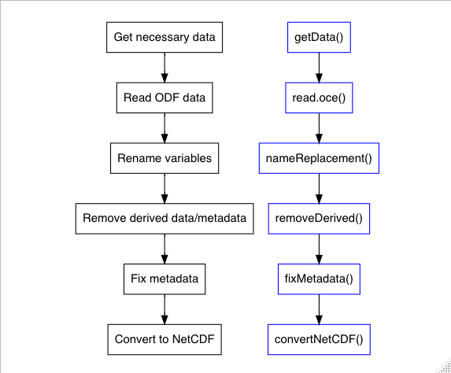

# Introduction

This vignette discusses the steps to convert a moored conductivity-temperature-depth (CTD) or a  rotary current meter (RCM) file to a NetCDF file. To date (2023/03/09) `odfToNetCDF` has the ability to convert MCAT files originating from ODFs or matlab files. In addition, it has the ability to convert RCM files strictly from ODF. To convert a list of CTD or RCM ODF files, follow the work flow provided below. The data used in this example is from the Davis Strait with an ODF origin.



# 1: Get necessary standard data

## getStandardData()

To get the necessary data, use the `getStandardData()` function. This function gets the available standard names, units, codes,names, and type of data for the required information for the specified instrument type. The default `standard` argument is `cf`, which indicates to obtain the climate and forecast data. As of 2023/03/09, the user now has the option to do `standard="bodc"` to obtain standard information from the British Oceanographic Data Center.

## standardMetadata()

`standardMetadata()` is an optional function that inserts the required global attributes that are "highly recommended" for the IOOS (Integrated Ocean Observing System) standards (see Reference 2). This function works by extracting what it can from the data and metadata within the `oce` object, but if its required field is determined to be NULL the user will be prompted to enter in the required information. If `fixed=TRUE`, the information that is input by the user will be saved as a data frame and applied to a list of `oce` objects (See Details). See `?standardMetadata()` for more information.

# 2: Creating oce objects

## read.oce()

To read an oceanographic data file of origin ODF or matlab, use `read.oce()` from the `oce` package. This function "reads an oceanographic data file, auto-discovering the file type from the first line of the file. This function tries to infer the file type from the first line, using `oceMagic()`. If it can be discovered, then an instrument-specific file reading function is called, with the file and with any additional arguments being supplied." (Kelley and Richards, 2022).

## matlabToOce()

If the origin of the file is a matlab file for a MCTD, the user must instead use the `matlabToOce()` function. This function removes NaN values in moored CTD Matlab files. It starts by reading a matlab file `readMat()`, then cycling through the multiple profiles of multiple stations to determine which data values are finite. The finite data values are then used to create an oce ctd object using `as.ctd()`.

# 3 Rename variables in climate forecast (CF) standard

To rename variables in CF standard, use the `nameReplacement()` function. This function replaces DFO codes with CF standards. For ctd types, if conductivity ratio (CRAT) exists, the values are converted to sea_water_electrical_conductivity values to abide by CF standards, and the unit is changed to the specified unit.

# Remove derived data/metadata

To remove derived data and metadata, use the `removeDerived()` function. This function removes data and metadata that is derived. For a CTD type, the only data and metadata kept is time, conductivity, salinity, temperature, and pressure. For an RCM type, the only data and metadata kept is horizontal_current_direction, barotropic_sea_water_x_velocity, sea_water_pressure, sea_water_practical_salinity,
time, and sea_water_temperature.

# Fix the metadata

To fix the metadata, use the `fixMetadata()` function. This function ensures the proper units are associated with each variable and adds place holders for flags if they do not already exist.

# Convert ODF to NetCDF

To finally convert an ODF file to a NetCDF file, use the `convertNetCDF()` function. This function converts and odf object to a netCDF files for CTD and RCM types.

The `convertNetCDF()` function does the following:

Step 1: Remove the time
Step 2: Determine units and standard_name for each code (using divideDataFrame.R)
Step 3: Populate the variable, var, units, max,min, standard_name, and flags
Step 4: About to check number of variables
Step 5: Check dimensions of time, station, lon, lat, and dimnchar
Step 6: Define netCDF variables using ncvar_def.
Step 7: Create  new netCDF file on disk using nc_create.
Step 8: Insert data to an existing netCDF using ncvar_put
Step 9: Insert attributes (metadata) into a netCDF file

# Workflow

A typical workflow for an ODF derived file is as follows:

```{r, eval=FALSE}
library(oceToNetCDF)
library(oce)
data <- getStandardData(type="ctd")
f <- system.file("extdata", "mctd.ODF", package="oceToNetCDF")
odf1 <- read.odf(f)
odf2 <- nameReplacement(odf1, data=data, unit="S/m")
odf3 <- removeDerived(odf2)
odf4 <- fixMetadata(odf3, data=data)
convertNetCDF(odf4, data=data)
```      


# Check odf metadata

In addition to the suggested work flow, the user also has the ability to use the `odfMetadataCheck()` function, which was 
provided by Emily O'Grady. This function checks that the ODF file has all of the required metadata needed to build a NetCDF file. This metadata includes: `longitude`, `latitude`, `type`, `model`, `samplingInterval`, `countryInstituteCode`, `cruiseNumber`, `station`, `serialNumber`, `cruise`, `sounding`, `scientist`, `waterDepth`, `depthMin`, `depthMax`, `institute`, and it ensures the names of the parameters conform to General Formatting (GF3) standards.

# Caution

It's important to note for MCTD files, there was no CF standard name or DFO code for Florescence. A code of FLOR and a standard_name of sea_water_fluorescence is used. For RCM files, code HCDT (Horizontal current direction (true)) and HCSP do not have a CF standard. The standard name has been added as horizontal_current_direction and horizontal_current_speed respectively. Additionally, unlike mCTD files, no data ranges are being checked. It's recommended that the user investigates the data themselves.

# Acknowlegments

We'd like to acknowledge the background information and starter functions created by Patrick Upson as well as testing and modifications made by Roger Pettipas.

# References

Kelley, D., and Richards, C. (2020). oce: Analysis of Oceanographic Data. Available online at: https://CRAN.R-project.org/package=oce (accessed August 23, 2022).

https://wiki.esipfed.org/Attribute_Convention_for_Data_Discovery_1-3#Global_Attributes


